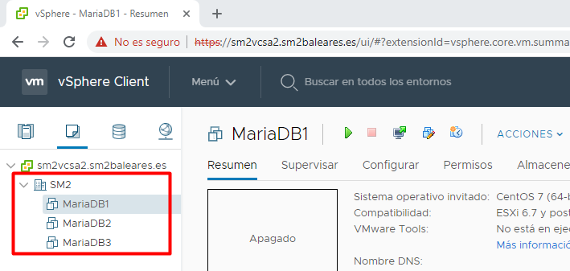
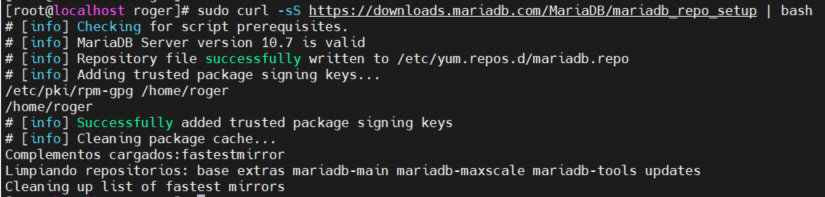
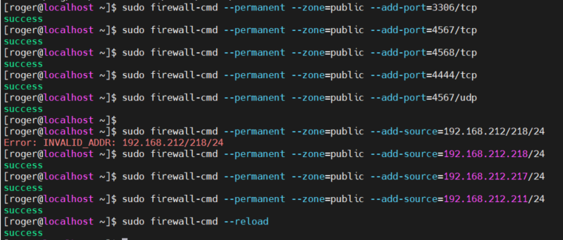
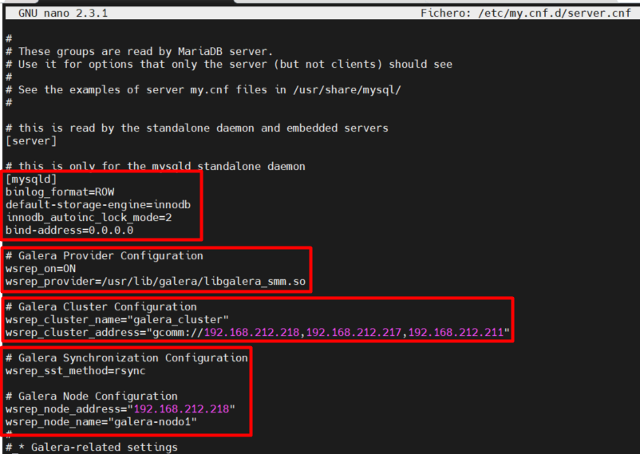

## Documentación Clúster MariaDB Galera
### Requisitos mínimos
Para este laboratorio utilizaremos las siguientes características

Sistema operativo: CentOS7
Memoria RAM: 1024MB
HD: 8GB

Si en realidad fuese un proyecto real, las características tendrían que ser:

Nodos: 3 mínimo "físico o virtual"
Sistema operativo: CentOS7
Memoria  RAM: 8192MB
CPU: 4 cores
HD: 40GB

### Instalación
Una vez creadas las máquinas, procedemos a instalar el Sistema Operativo CentOS7 y a configurar la red para que dichos nodos se vean entre ellos, nos saltaremos este proceso porque entiendo que conocemos dichos conocimientos.


Para empezar daremos por hecho que los nodos están configurados y que disponen de conectividad en red entre ellos. Por ello, lo primero que haremos será ir al fichero /etc/hosts y agregar cada nodo. Nosotros utilizaremos un rango de IP's que comprenden el rango de 192.168.212.244 - 192.168.212.254. Debido a este rango, nuestro fichero hosts tendrá la siguiente estructura.
```vim
127.0.0.1 localhost
192.168.212.245 nodo1.mariadbgalera.com galera-nodo1
192.168.212.246 nodo2.mariadbgalera.com galera-nodo2
192.168.212.247 nodo3.mariadbgalera.com galera-nodo3
```
Esto hará que cuando digamos el nombre de dominio "nodo1.mariadbgalera.com" sepa que apunta a la dirección IP 192.168.212.245. Es una buena práctica para no tener que estar trabajando con las direcciones IP.

Para instalar MariaDB en centOS debemos añadir el repositorio en nuestro fichero /etc/yum.repos.d. Luego utilizaremos el comando 
```
yum makecache fast
yum install -y mariadb-server galera
```


Una vez instalado debemos abrir los puertos.
* El puerto 3306 para las conexiones desde el cliente de MariaDB y el State Snapshot Transfer que usa el comando mysqldump.
* El puerto 4567 en TCP y UDP para permitir la replicación de datos de Galera entre los nodos.
* El puerto 4568 para los Incremental State Transfers, or IST, proceso mediante el cual un estado faltante es recibido por los otros nodos del cluster.
* El puerto 4444 para todos los otros estados del State Snapshot Transfers, or SST, mecanismo mediante el cual un nodo que se une al cluster recibe el estado y los datos de otro nodo.



### Configurando Galera en los Nodos


Prestemos atención a los valores:

* La primera sección modifica los parámetros de MariaDB para que permita al clúster su correcto funcionamiento. Podemos observar como el motor por defecto es InnoDB en vez de MyISAM o cualquier otro motor no transaccional. Además de esto, el valor del parámetro bind-address en 0.0.0.0 permitirá la conexión desde cualquier dirección IP.

* La sección “Galera Provider Configuration” configura los componentes de MariaDB que proveen una API replicación WriteSet. Es decir, en nuestro caso, Galera es un proveedor wsrep (WriteSet Replication)

* La sección “Galera Cluster Configuration” define el clúster, identificando los miembros del mismo por sus direcciones IP o por sus nombres DNS y crea un nombre para el cluster el cual debe ser igual para todos los nodos (parametro wsrep_cluster_name) El valor del parámetro wsrep_cluster_address debe tener las direcciones IP de los tres nodos que estamos configurando.

* La sección “Galera Synchronization Configuration” define como el cluster se comunicará y sincronizará los datos entre nodos. Esto es usado solamente para la transferencia de estado el cual sucede cuando el nodo pasa a estado Online. Para la configuración inicial, se usa rsync porque es está comunmente disponible y es lo que se necesita de momento.

* Y para finalizar, la sección “Galera Node Configuration” muestra claramente la dirección IP y el nombre del Nodo, lo que ayuda a diagnosticar problemas en los logs. El parámetro wsrep_node_address debe coincidir con las direcciones IP de los Nodos, sin embargo, se puede escoger cualquier nombre para ayudar a identificar cualquier problema en los logs del Nodo.

Dicho esto, modifiquemos los valores por cada nodo:
```
wsrep_cluster_name=“Nombre del cluster(personalizado)”
wsrep_cluster_address=“gcomm://Direcciones IP de todos los nodos separados por comas”

wsrep_node_address=“Direccion IP de Cada Nodo”
wsrep_node_name=“Nombre del Nodo”
```
 # OJO!
 El fichero /usr/lib/galera/libgalera_smm.so se encuentra en la ruta /usr/lib64/galera-4/libgalera_smm.so

## Extra
### Documentacion ClusterControl
Link para instalar la herramienta:

https://severalnines.com/download-clustercontrol-database-management-system

Pull image:

```bash
docker pull severalnines/clustercontrol
```

Run container:
```bash
docker run d severalnines/clustercontrol
```
Sin embargo, para uso en producción, se recomienda a los usuarios ejecutar con una dirección IP fija/nombre de host y volúmenes persistentes para sobrevivir a los reinicios, actualizaciones y reprogramaciones, como se muestra a continuación:
```bash
# Create a Docker network
$ docker network create --subnet=192.168.10.0/24 db-cluster
 
# Start the container
$ docker run -d --name clustercontrol \
--network db-cluster \
--ip 192.168.10.10 \
-h clustercontrol \
-p 5000:80 \
-p 5001:443 \
-v /storage/clustercontrol/cmon.d:/etc/cmon.d \
-v /storage/clustercontrol/datadir:/var/lib/mysql \
-v /storage/clustercontrol/sshkey:/root/.ssh \
-v /storage/clustercontrol/cmonlib:/var/lib/cmon \
-v /storage/clustercontrol/backups:/root/backups \
severalnines/clustercontrol
```

# OJO!
Si instalamos el clustercontrol a través del script, debemos modificar dicho script y quitar todas las dependencias "php5" y dejarlas como "php"

Una vez lanzado el contenedor, debemos seguir este manual para enlazar las claves ssh.

https://docs.severalnines.com/docs/clustercontrol/requirements/passwordless-ssh/

https://github.com/severalnines/docker#image-description
